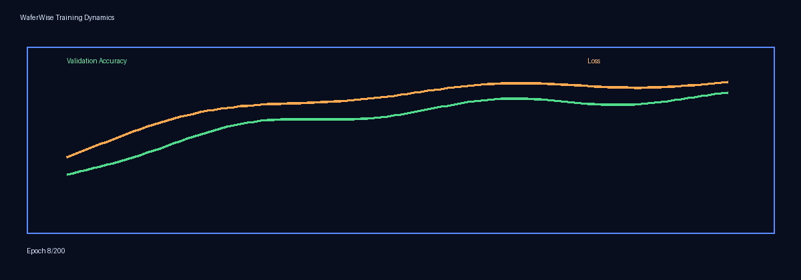
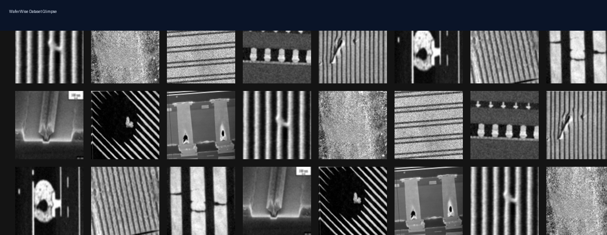
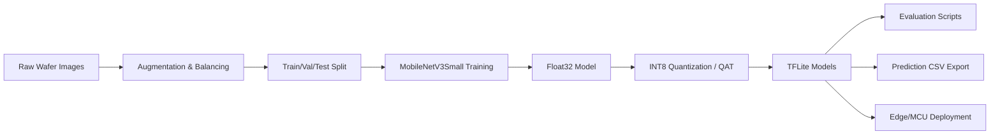
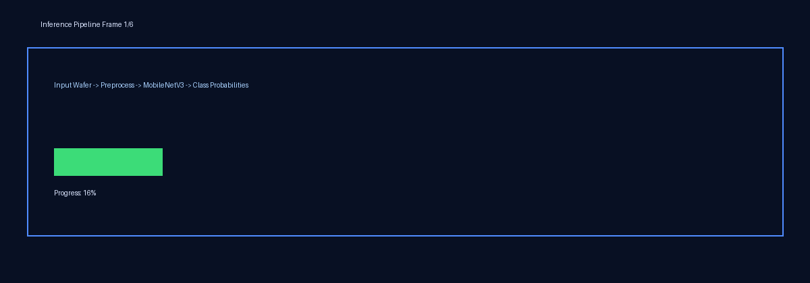
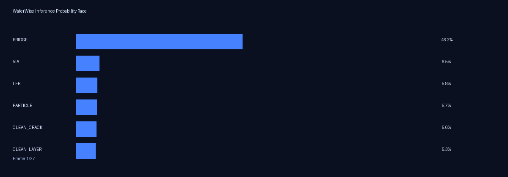
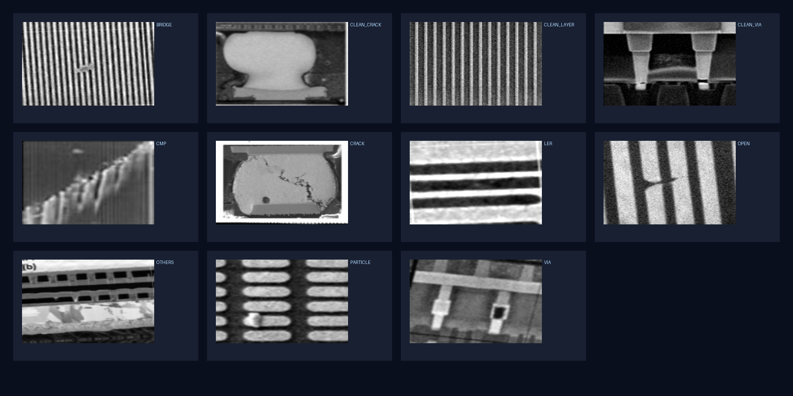

# <div align="center">🧠 WaferWise — AI-Based Wafer Defect Classification</div>

<div align="center">
  <strong>Production-ready deep learning pipeline for semiconductor wafer defect detection, classification, and edge deployment (TFLite INT8).</strong>
</div>

<div align="center">
  
  <br/>
  
</div>

<br/>

<div align="center">
  
</div>

---

<div align="center">


</div>

---

## 🚀 Overview

**WaferWise** is an AI-based wafer defect classification system built to support high-speed visual inspection workflows in semiconductor manufacturing.

It includes:
- dataset preparation + augmentation,
- deep model training (MobileNetV3Small),
- float32 → int8 optimization for edge/MCU deployment,
- comprehensive evaluation scripts,
- prediction export for hackathon/benchmark datasets.

The project targets **11 wafer defect classes** and includes utilities for both standard and constrained-device inference.

> 💡 Designed for practical use cases where **accuracy, small model size, and deployability** are all critical.

---

## ❓ Why this project matters

Manual wafer inspection is slow, inconsistent, and expensive at scale. WaferWise helps teams:
- reduce inspection turnaround time,
- improve defect detection consistency,
- deploy optimized models on edge hardware using **TFLite INT8**,
- accelerate model iteration via reproducible training/testing scripts.

---

## ✨ Key Features

- 🔍 **11-class wafer defect classification**
- 🧪 **Extensive dataset augmentation pipeline** (`augment_dataset.py`)
- 🧠 **MobileNetV3Small-based training** for accuracy/efficiency balance
- ⚙️ **INT8 quantization flow** (with optional QAT when `tfmot` is available)
- 📦 **TFLite export** for deployment-ready inference
- 📊 **Evaluation scripts** with per-class metrics, F1, confusion matrix
- 🧾 **CSV prediction export** for challenge/test submissions
- 🛠️ **MCU-oriented utilities** (e.g., C header generation in training flow)

---

## 🧠 How It Works

1. **Prepare dataset** in class-wise folder format.
2. **Augment and balance data** to reduce class imbalance.
3. **Train model** using MobileNetV3Small backbone.
4. **Fine-tune + optimize** model for INT8 inference.
5. **Convert to TFLite** and validate on held-out/test datasets.
6. **Run predictions** on challenge/test images and export results.

---

## 🏗️ Architecture



---

## 🛠️ Tech Stack

| Category | Tools |
|---|---|
| Language | Python |
| Deep Learning | TensorFlow / Keras |
| Optimization | TensorFlow Lite, INT8 Quantization, Optional TFMOT (QAT) |
| Data Processing | NumPy, Pillow |
| Validation | Custom metric scripts, confusion matrix reporting |
| Version Control | Git, GitHub |

---

## 📸 Demo / Screenshots

<div align="center">
  
  <br/><br/>
  
  <br/><br/>
  
</div>

<div align="center">
  <sub>🎞️ The GIF is generated from the project pipeline to add motion-based storytelling in the README.</sub>
</div>

---

## ⚙️ Installation Guide

```bash
# 1) Clone
git clone https://github.com/TharunBabu-05/WaferWise_AI-based_Wafer_defect_Classification.git
cd WaferWise_AI-based_Wafer_defect_Classification

# 2) Create virtual environment
python -m venv .venv

# 3) Activate (Windows PowerShell)
.venv\Scripts\Activate.ps1

# 4) Install dependencies
pip install -r requirements.txt
```

---

## ⚡ Quickstart (Minimal)

```bash
# 1) Augment/balance dataset
python augment_dataset.py

# 2) Train + export INT8 model
python train_int8_optimized.py

# 3) Evaluate on held-out split
python test_int8_model.py
```

---

## ▶️ Usage Instructions

### 1) Augment training data
```bash
python augment_dataset.py
```

### 2) Train optimized model
```bash
python train_int8_optimized.py
```

### 3) Convert float model to int8 (alternate flow)
```bash
python convert_float32_to_int8.py
```

### 4) Evaluate int8 model
```bash
python test_int8_model.py
```

### 5) Predict on phase3 dataset and export CSV
```bash
python predict_phase3_dataset.py
```

---

## 📂 Project Structure

```text
WaferWise_AI-based_Wafer_defect_Classification/
├── augment_dataset.py
├── train_mobilenetv3_final.py
├── train_int8_optimized.py
├── train_phase3_final_hackathon_day-1.py
├── convert_float32_to_int8.py
├── predict_phase3_dataset.py
├── assets/
│   └── readme/
│       ├── hero_collage.png
│       ├── dataset_grid.png
│       └── pipeline_demo.gif
├── test_int8_model.py
├── test_hackathon_test_dataset.py
├── test_phase3_final_hackathon_day-1.py
├── model_output/
├── final_4000_dataset/
├── Hackathon_phase3_augmented_4000/
├── Hackathon_phase3_training_dataset/
├── Hackathon_phase3_prediction_dataset/
└── hackathon_test_dataset/
```

---

## 🧩 Dataset Format & Classes

Expected layout (one folder per class):

```text
dataset_root/
├── BRIDGE/
├── CLEAN_CRACK/
├── CLEAN_LAYER/
├── CLEAN_VIA/
├── CMP/
├── CRACK/
├── LER/
├── OPEN/
├── OTHERS/
├── PARTICLE/
└── VIA/
```

Class index order is recorded in the `labels.json` file inside each `model_output/*` run folder.

---

## 🔌 Modules / Script Guide

| Script | Purpose |
|---|---|
| `augment_dataset.py` | Balances and augments wafer images per class |
| `train_mobilenetv3_final.py` | MobileNetV3Small training + TFLite conversion + C headers |
| `train_int8_optimized.py` | Phase-3 optimized training with optional QAT + full int8 export |
| `convert_float32_to_int8.py` | Post-training quantization utility |
| `test_int8_model.py` | Held-out test set evaluation with detailed metrics |
| `test_hackathon_test_dataset.py` | Evaluates model on mapped hackathon 9-class test setup |
| `predict_phase3_dataset.py` | Batch inference + CSV export for prediction dataset |

---

## 📦 Exported Artifacts

Training and conversion flows emit:

- `best_model.keras` (Keras checkpoint)
- `wafer_classifier_float32.tflite` and/or `wafer_classifier_int8.tflite`
- `labels.json` (class order), optional `labels.txt`
- `wafer_model.h` and `wafer_labels.h` for MCU/embedded use

Artifacts are stored under `model_output/<run_name>/`.

---

## 🧪 TFLite Inference Snippet

```python
import numpy as np
import tensorflow as tf

interpreter = tf.lite.Interpreter(
  model_path="model_output/your_run/wafer_classifier_int8.tflite"
)
interpreter.allocate_tensors()

input_details = interpreter.get_input_details()
output_details = interpreter.get_output_details()

# Replace with your preprocessed image tensor
x = np.zeros(input_details[0]["shape"], dtype=input_details[0]["dtype"])
interpreter.set_tensor(input_details[0]["index"], x)
interpreter.invoke()

pred = interpreter.get_tensor(output_details[0]["index"])
print(pred)
```

---

## 📊 Performance / Results

This repository includes metric-oriented evaluation scripts that report:
- overall accuracy,
- per-class accuracy,
- precision / recall / F1,
- weighted F1,
- confusion matrix,
- model size in KB/MB.

### ✅ Recorded Benchmarks (from saved result files)

| Evaluation | Model | Dataset | Images | Accuracy | Weighted F1 | Model Size |
|---|---|---|---:|---:|---:|---:|
| `test_results.json` | Float32 TFLite | Held-out test split | 400 | **91.25%** | **91.33%** | _not recorded_ |
| `int8_test_results.json` | INT8 TFLite | Held-out test split | 400 | **9.00%** | **3.63%** | **677.98 KB** |
| `hackathon_test_results_int8.json` | INT8 TFLite | `hackathon_test_dataset` | 296 | **10.47%** | **4.93%** | **677.98 KB** |

> Source files:  
> `model_output/phase3_final_float32/test_results.json`  
> `model_output/phase3_final_float32/int8_test_results.json`  
> `model_output/phase3_final_float32/hackathon_test_results_int8.json`

> Tip: If INT8 accuracy is low, verify preprocessing parity between training and representative dataset calibration.

<details>
<summary><strong>Expand for recommended benchmark reporting format</strong></summary>

| Model | Input | Quantization | Size | Accuracy | Notes |
|---|---|---|---|---|---|
| MobileNetV3Small | 128×128×1 | Float32 | _TBD_ | _TBD_ | Baseline |
| MobileNetV3Small | 128×128×1 | INT8 | _TBD_ | _TBD_ | Edge deployment |

</details>

---

## 🌍 Real-World Applications

- Semiconductor fab inline inspection
- Yield improvement analytics pipelines
- Edge AI defect screening stations
- Academic/industrial wafer defect benchmarking

---

## 🧪 Comparison vs Traditional Inspection

| Aspect | Manual Inspection | WaferWise (AI) |
|---|---|---|
| Speed | Slow / operator dependent | Fast batch inference |
| Consistency | Varies by inspector | Repeatable model behavior |
| Scalability | Limited | High (automated pipelines) |
| Deployment | Human-intensive | Cloud + Edge/MCU capable |

---

## 🧭 Roadmap / Future Improvements

- [ ] Add pinned `requirements-lock.txt` via pip-tools
- [ ] Add training/inference CLI with argparse
- [ ] Integrate experiment tracking (MLflow/W&B)
- [ ] Add Grad-CAM explainability visuals
- [ ] Add CI for linting + smoke inference test
- [ ] Introduce lightweight API service for inference

---

## 🧩 Troubleshooting

- If INT8 accuracy is low, confirm representative dataset preprocessing matches training (resize, grayscale, normalization).
- Ensure class folder names match the expected labels; check `labels.json` for the exact order.
- If inference fails, use `interpreter.get_input_details()` to verify dtype and shape.

---

## 👔 Recruiter-Friendly Highlights

- Built an end-to-end CV pipeline from data curation to edge deployment.
- Applied model optimization (INT8/QAT) for hardware-constrained use cases.
- Implemented robust evaluation pipelines with class-wise quality diagnostics.
- Solved domain-specific class mapping challenges for benchmark alignment.

---

## 🤝 Contributing

Contributions are welcome!

```bash
# Fork → Create feature branch
git checkout -b feat/your-feature

# Commit changes
git commit -m "feat: add your feature"

# Push and open PR
git push origin feat/your-feature
```

Please open an issue first for major changes.

---

## 📜 License

This project is licensed under the **MIT License**.  
See [`LICENSE`](./LICENSE) for full text.

---

## 🙌 Acknowledgements

- TensorFlow & Keras ecosystem
- TFLite optimization tooling
- Semiconductor vision research community
- Hackathon dataset and benchmarking context

---

## 📬 Contact / Author

**Tharun Babu**  
GitHub: [@TharunBabu-05](https://github.com/TharunBabu-05)

---

## 📈 GitHub Insights

<div align="center">


</div>

<div align="center">
  
</div>

---

<div align="center">
  <sub>Built with precision for intelligent wafer inspection ⚡</sub>
</div>
